 

Profile · Projects · Stack · Currently · Interests · Contact

Profile

I'm a Computer Science student focused on AI systems, software engineering, developer tooling, and automation.

I build software to understand how systems work — from local LLM pipelines and AI agents to backend infrastructure and full-stack products. My current focus is turning AI from a simple chat interface into software that can understand codebases, use tools, and execute useful workflows.

Projects

AbhiCode

An AI coding partner focused on understanding an entire codebase rather than generating isolated snippets.

Focus: codebase understanding · repository intelligence · context management · local LLMs · AI agents · developer automation

Naaphaa

An AgriTech product focused on practical intelligence and workflows for farmers.

Focus: mandi intelligence · market information · group selling · farmer workflows · AI-powered tools

Claude Evidence Engine

An experiment in evidence retrieval and verification for AI systems.

Focus: multi-source retrieval · evidence comparison · verification · grounded answers

Stack

Languages
Python · C++ · JavaScript · TypeScript

AI / ML
LLMs · AI Agents · RAG · Embeddings · Local Inference · Ollama

Development
React · Vite · Node.js · REST APIs · Supabase

Systems
Linux · Git · GitHub · Docker · SQLite · Vercel · Cloudflare

Currently

Building AbhiCode and exploring local LLM architectures, AI agents, code intelligence, context engineering, and developer tooling.

Interests

Artificial Intelligence · Software Architecture · Developer Tools · Systems Engineering · Automation · Reverse Engineering · Startups · AgriTech

Contact

GitHub · X

 

Build → Break → Understand → Improve

